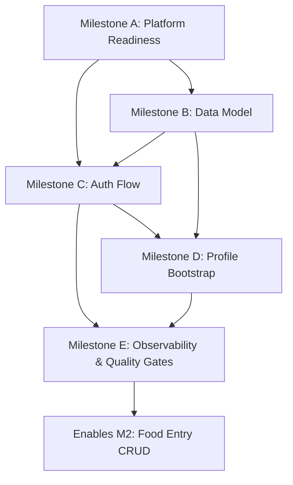

# M1 Implementation Plan: Readiness for Auth + Profile Foundation

## Context and Goal
This plan translates `VISION.md` into an execution-ready Milestone 1 (M1) plan focused on shipping **Auth and Profile Foundation** with quality gates that de-risk downstream milestones.

M1 delivers:
- Secure sign-in/sign-up (email/password + OAuth scaffolding)
- User profile bootstrap (timezone, units, calorie goal target)
- Baseline data model and migrations (`users`, `profiles`)
- API/service boundaries and validation patterns used by later food logging features
- Observability and test harness needed for subsequent milestones

## Scope for M1

### In Scope
1. **Authentication foundation**
   - Session-based auth integrated with Next.js App Router
   - Email/password flow with secure hashing and validation
   - OAuth provider abstraction (at least one provider enabled + extensibility path)
2. **Profile management**
   - Create/edit profile fields: timezone, units, daily calorie goal
   - Server-side validation for profile constraints
   - Default profile creation on first successful sign-in
3. **Persistence and API boundaries**
   - Prisma schema and Postgres migrations for `users` + `profiles`
   - Route handlers + service layer contracts for auth/profile workflows
4. **Operational baseline**
   - Request logging, error capture, and core auth analytics events
   - CI checks for lint/type/test

### Out of Scope (for M1)
- Food entry CRUD
- Trend chart rendering and rollup jobs
- Favorites/recents UX
- Advanced analytics dashboards

## Milestones and Sequencing

### Milestone A — Project & Platform Readiness (Day 1–2)
**Objective:** establish implementation guardrails and developer workflow.

Tasks:
- Confirm stack versions (Next.js, Prisma, Postgres client, auth library)
- Add env contract (`.env.example`) and secrets loading checks
- Set up CI pipeline: lint + typecheck + unit test skeleton
- Define coding conventions for route/service boundaries

Exit criteria:
- CI runs green on default branch
- Local dev bootstrap documented and reproducible

---

### Milestone B — Data Model Foundation (Day 2–3)
**Objective:** ship durable schema for auth/profile.

Tasks:
- Create Prisma models for `users` and `profiles`
- Add indexes/constraints (email uniqueness, one profile per user)
- Implement initial migration and rollback verification
- Seed script for local smoke testing

Exit criteria:
- Migration applies cleanly to empty DB and rollback path tested
- Schema validated against required profile fields in vision

---

### Milestone C — Authentication Flow (Day 3–5)
**Objective:** secure account lifecycle and session handling.

Tasks:
- Implement sign-up/sign-in/sign-out routes and server actions
- Password hashing + auth rate-limiting strategy
- OAuth provider integration with provider abstraction
- Session management and route protection middleware

Exit criteria:
- Happy path + invalid credential + locked/rate-limited behavior verified
- Protected routes inaccessible without valid session

---

### Milestone D — Profile Bootstrap & Settings (Day 5–6)
**Objective:** ensure every active account can set and maintain profile defaults.

Tasks:
- Auto-create profile on first sign-in
- Build profile settings UI and API handlers
- Validate timezone, units enum, calorie target numeric bounds
- Add basic UX/error states

Exit criteria:
- New user reaches usable profile state in first session
- Profile updates are persisted and reflected on reload

---

### Milestone E — Observability + Quality Gates (Day 6–7)
**Objective:** make M1 releasable and safe for M2 dependencies.

Tasks:
- Instrument auth/profile events (signup_started/completed, login_success/failure, profile_updated)
- Add structured request logs and error boundary logging
- Complete unit + integration + minimal e2e auth/profile paths
- Performance check for p95 auth/profile writes under target envelope

Exit criteria:
- Required tests pass in CI
- SLO/SLI smoke checks documented
- Release checklist completed

## Dependency Graph

### Critical Path
A → B → C → D → E

### Parallelizable Work
- CI/test harness hardening (A/E) can run in parallel with parts of B and C
- UI shell for profile settings can start before C completion using mocked auth session

## Risk Register

| ID | Risk | Likelihood | Impact | Mitigation | Owner | Trigger/Signal |
|---|---|---:|---:|---|---|---|
| R1 | Auth library integration drift with App Router patterns | Medium | High | Spike implementation in A; lock versions; add integration tests early | Backend Lead | Repeated session invalidation defects |
| R2 | Schema churn due to unclear `users`/`profiles` responsibilities | Medium | Medium | Publish model ADR before migration merge; enforce one-profile-per-user invariant | Tech Lead | Multiple migration revisions in same sprint |
| R3 | OAuth setup delays (provider config/secrets) | Medium | Medium | Deliver email/password first; keep OAuth behind feature flag | Platform Engineer | Missing provider credentials by Day 4 |
| R4 | Validation gaps allow invalid calorie targets/timezones | Low | High | Shared validation schema across API/UI; boundary tests | Full-stack Engineer | Production logs show 4xx spikes for profile updates |
| R5 | CI instability blocks sequencing | Medium | High | Add deterministic test fixtures; isolate DB tests with ephemeral DB | DevEx | Flaky test rate > 5% |
| R6 | Performance regressions from sync profile writes | Low | Medium | Measure p95 on key write paths; optimize DB indexes and query plans | Backend Lead | p95 > 500ms in staging smoke |

## Test Strategy

## 1) Test Pyramid
- **Unit tests (fast):** validation logic, service-layer transformations, auth utility functions
- **Integration tests:** route handlers + DB for signup/login/profile update flows
- **E2E tests (critical journeys only):** create account → first login → set profile → logout/login persistence

## 2) Coverage Targets for M1
- Service + validation modules: **>= 85% line coverage**
- Auth/profile integration routes: all happy + key failure cases covered
- E2E: at least 3 deterministic scenarios (new user, returning user, invalid update)

## 3) Quality Gates (must pass before merge)
1. Lint/typecheck: pass
2. Unit tests: pass
3. Integration tests: pass against disposable Postgres instance
4. E2E smoke for auth/profile: pass in CI
5. Migration forward/backward sanity check: pass
6. Security checks: password hashing and secret handling verified via checklist

## 4) Non-Functional Verification
- Measure p95 response time for login/profile-update endpoints under representative local load
- Confirm no sensitive fields leak to logs
- Validate account deletion path stories are captured as follow-up (M2+ if not implemented)

## 5) Test Data and Environments
- Use deterministic seed users and fixtures
- Ephemeral test database per CI run
- Separate `.env.test` contract with explicit defaults

## Implementation Readiness Checklist
- [ ] M1 scope accepted and frozen
- [ ] Owners assigned per milestone
- [ ] Migration plan reviewed
- [ ] CI quality gates configured and required
- [ ] Auth threat-model mini-review completed
- [ ] Roll-forward/rollback playbook documented
- [ ] Handoff notes prepared for M2 dependency consumers
